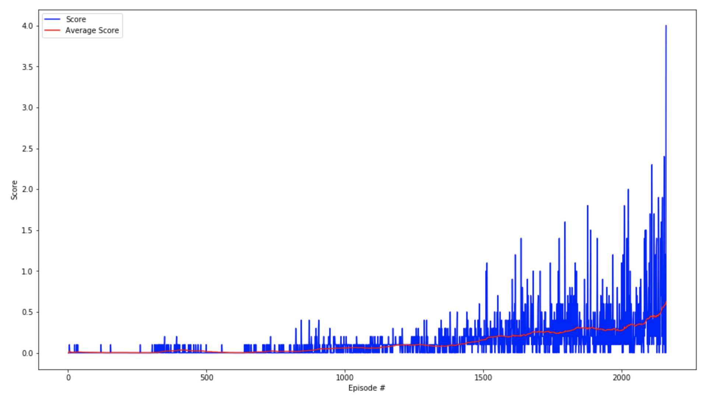

# Tennis Project Report

In this project, I used multi-agent DDPG with 2 agents playing against each other.


### Learning Algorithm
I used the DDPG code Udacity provided in PyTorch and adapted it for 2 agents to compete against each other. The input feature is 48-dimensional. The actor network predicts the action based on the current state. It has a `tanh` activation at the output layer, as action space is a real number between -1.0 and 1.0. The critic network decides the value of the state-action pair.

My work uses Actor-Critic:
- Actor
  1. Linear(in_features=48, out_features=256, bias=True) + Relu activation
  2. Linear(in_features=256, out_features=128, bias=True) + Relu activation
  3. Linear(in_features=128, out_features=2, bias=True) + tanh activation


- Critic
  1. Linear(in_features=48, out_features=256, bias=True) + Batch Normalization + Relu activation
  2. Linear(in_features=260, out_features=128, bias=True) + Relu activation
  3. Linear(in_features=128, out_features=1, bias=True) + sigmoid activattion


#### Hyperparameter list
```
- BUFFER_SIZE = int(1e6)  # replay buffer size
- BATCH_SIZE = 128        # minibatch size
- GAMMA = 0.99            # discount factor
- TAU = 1e-3              # for soft update of target parameters
- LR_ACTOR = 1e-3         # learning rate of the actor 
- LR_CRITIC = 1e-3        # learning rate of the critic
- WEIGHT_DECAY = 0        # L2 weight decay
```


### Plot of Results 
The plot below shows the score and average score during each episode. The averaged score from episode 2061 to 2161 is 0.629, which is above our 0.5 goal.




### Ideas for Future Work
- Further tune the hyperparameters to get higher scores, faster converging, and more robust results.
- Train for longer time to see how strong the tennis player could eventually be.
- Take the more challenging soccer work.
- Try out prioritized experience replay.
